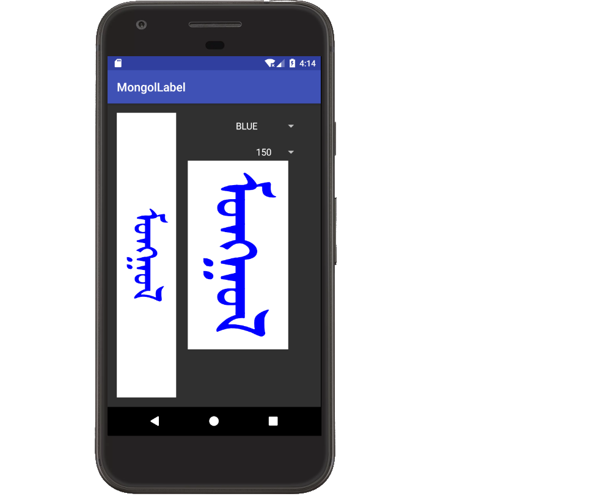

# Mongol Library

Android UI components for vertical Mongolian text 

## Table of Contents 

* [Introduction](https://github.com/suragch/mongol-library#introduction)
* [Installing](https://github.com/suragch/mongol-library#installing)
* [UI Componants](https://github.com/suragch/mongol-library#uicomponants)
    * [MongolTextView](https://github.com/suragch/mongol-library#mongoltextview) 
    * [MongolLabel](https://github.com/suragch/mongol-library#mongollabel)
    * [MongolEditText](https://github.com/suragch/mongol-library#mongoledittext)
    * [Keyboards](https://github.com/suragch/mongol-library#keyboard)
    * [MongolToast](https://github.com/suragch/mongol-library#mongoltoast)
    * [MongolAlertDialog](https://github.com/suragch/mongol-library#mongolalertdialog)
* [Unicode](https://github.com/suragch/mongol-library#unicode)
* [Fonts](https://github.com/suragch/mongol-library#fonts)
* [Other](https://github.com/suragch/mongol-library#other)
* [TODO](https://github.com/suragch/mongol-library#todo)
* [How to contribute](https://github.com/suragch/mongol-library#how-to-contribute)
* [Versions](https://github.com/suragch/mongol-library#version-changes)
* [External links](https://github.com/suragch/mongol-library#external-links)
* [Apps that use this library](https://github.com/suragch/mongol-library#apps-that-use-this-library)
 
## Introduction

This Android library is a collection of UI components that support vertical Mongolian text. 

All of the native Android UI components only support horizontal text. In addition to this, Android support for Mongolian Unicode rendering is inadequate. These challenges at a big hurdle for new Mongolian app developers to overcome. Most of the established Mongolian tech companies do not share their source code. While this is understandable since they must make a profit, new developers must reinvent all the basic UI text components from scratch. This makes the Mongolian app development process very slow. 

The purpose of this library is to make it easy to include vetical Mongolian Unicode text in your app. Developers can simply import the mongol-library module and then just focus on the content of their project.

Although this library is currently usable, there are still many improvements which need to be made. It is hoped that both novice and experienced developers will contribute with issue notifications and pull requests. Feel free to fork your own version, too. This library is desctibuted under the most permissive licence that I could find: the MIT licence. I believe that freely sharing information and source code will benefit everyone and help to make ancient Mongolian relevant in the modern world.
 
## Installing

This library is a part of the jCenter repository, which is the default in Android Studio. You should see this in your project's `build.gradle` file:

```java
repositories {
    jcenter()
}
```

You can import `mongol-library` into your project from jCenter by adding the following line to your dependencies in your app module's `build.gradle` file:

```java
dependencies {
    compile 'net.studymongolian:mongol-library:0.8.1'
}
```

## UI Componants

The following are the primary UI componants in the library. If you don't understand how to use any of them, open an issue and I will improve the documentation. See also the [Demo App](../tree/master/demo-app). 

### MongolTextView 

The `MongolTextView` is a vertical text replacement for the standard Android `TextView`. It measures and lays out text from top to bottom and vertical lines are laid out from left to right. No mirroring is done internally so mirrored fonts are not required (if you want to add additional fonts). As much as possible the [API](https://github.com/suragch/mongol-library/blob/master/mongol-library/src/main/java/net/studymongolian/mongollibrary/MongolTextView.java) seeks to follow the standard `TextView` [API](https://developer.android.com/reference/android/widget/TextView.html).

#### Basic usage

You can create a `MongolTextView` exclusively in XML or in code.


XML example

```xml
<LinearLayout
    xmlns:android="http://schemas.android.com/apk/res/android"
    xmlns:app="http://schemas.android.com/apk/res-auto"
    android:layout_width="match_parent"
    android:layout_height="match_parent"
    android:padding="20dp">
    
    <net.studymongolian.mongollibrary.MongolTextView
        android:id="@+id/mongol_text_view_id"
        android:layout_height="wrap_content"
        android:layout_width="wrap_content"
        app:text="ᠰᠠᠢᠨ ᠪᠠᠢᠨ᠎ᠠ ᠤᠤ︖"
        app:textSize="24sp"
        app:textColor="@android:color/black"/>
    
</LinearLayout>
```

Code example

```java
public class MainActivity extends AppCompatActivity {

    @Override
    protected void onCreate(Bundle savedInstanceState) {
        super.onCreate(savedInstanceState);
        setContentView(R.layout.activity_main);

        MongolTextView mongolTextView = (MongolTextView) findViewById(R.id.mongol_text_view_id);
        mongolTextView.setText("ᠮᠣᠩᠭᠣᠯ");
        mongolTextView.setTextColor(Color.BLUE);
    }
}
```

#### Features

Other features of MongolTextView include the following:

* Text color
* Text size
* Font
* Alignment
* Padding
* Spans
    * Background color
    * Foreground color
    * Relative size
    * Typeface
    * Style
    * Subscript
    * (TODO underline)
* (TODO line spacing)
* Emoji support
* CJK orientation support
* Unicode support

These can be further explored with the [Demo App](demo-app).


### MongolLabel 

`MongolLabel` is a light weight view similar to `MongolTextView`. It is less expensive because it does not have to calculate multi-line, emoji rotation, or spans. If you need a large number of MongolTextViews and are experiencing performance problems, then this may be a solution.

Supports:

* Unicode 
* text color
* text size
* fonts (typeface)
* centered in view
* auto text resizing if font too big for view size

Does not support:

* multi-line text
* CJK/emoji rotation 
* text spans

Here is an image of the [Demo App](demo-app):




### MongolEditText 

The `MongolEditText` is a vertical text replacement for the standard Android `EditText`. As much as possible the [API](https://github.com/suragch/mongol-library/blob/master/mongol-library/src/main/java/net/studymongolian/mongollibrary/MongolEditText.java) seeks to follow the standard `EditText` [API](https://developer.android.com/reference/android/widget/EditText.html). It subclasses `MongolTextView`. In addition to allowing cursor location and text selection, it also adds the API elements needed to communicate with both custom in-app keyboards and system keyboards. 

#### Basic usage

The following image shows `MongolEditText` receiving text input from the Menksoft and Delehi system keyboards.


###### XML example

```xml
<RelativeLayout xmlns:android="http://schemas.android.com/apk/res/android"
                xmlns:app="http://schemas.android.com/apk/res-auto"
                android:layout_width="match_parent"
                android:layout_height="match_parent"
                android:padding="20dp">

    <HorizontalScrollView
        android:id="@+id/hsvEditTextContainer"
        android:layout_width="match_parent"
        android:layout_height="wrap_content"
        android:fillViewport="true">

        <net.studymongolian.mongollibrary.MongolEditText
            android:id="@+id/metExample"
            android:layout_width="wrap_content"
            android:layout_height="200dp"
            android:padding="10dp"
            android:background="@android:color/white"
            app:text=""
            app:textSize="30sp"/>

    </HorizontalScrollView>

</RelativeLayout>
```

Note that since `MongolEditText` does not support scrolling itself yet, it is good to wrap it in a `HorizontalScrollView`. 

###### Code example

```java
MongolEditText mongolEditText = (MongolEditText) findViewById(R.id.metExample);
String text = mongolEditText.getText().toString();
```

#### Features

* Accepts input from system keyboards and mongol-library keyboards. 
* text selection 
* highlight words on double click
* change selection on drag
* conforms to the Editable protocol 
* Unicode indexing (handles glyph indexing internally) 
* also supports Menksoft code

### Keyboard

It cannot be assumed that all users will have a Mongol IME (like the Menksoft or Delhi keyboards) installed on their phone, so if you need Mongolian input in your app, you should probably include this in-app keyboard. 

#### Basic usage

Single keyboard -- single MongolEditText  
Multiple keyboards -- multiple edittexts

#### Features

* keyboards
    * AEIOU - the philosophy behind this keyboard is to make input as easy as possible. The general arrangement follows the order of the Mongolian alphabet. The buttons are large by making infrequently used letters only available as longpress popups. The Unicode distinctions between O/U, OE/UE, and T/D are hidden from the user. It has been reported that countryside Mongols who have less interaction with computer keyboards prefer this layout. 
    * QWERTY 
    * Cyrillic 
    * Latin 
* set key colors, borders, and corner radius 
* TODO set candidates 

### MongolToast 

`MongolToast` is a vertical version of Android `Toast`.

#### Basic usage

* code

#### Features

* set text
* set location 
* set time length 


### MongolAlertDialog

`MongolAlertDialog` is a vertical version of Android `AlertDialog`. It currently only supports a title, message, and up to 3 buttons. 

#### Basic usage

* code

####Features

* set title 
* set message 
* set buttons 
* set actions
* TODO check box, radio button, list

## Unicode 

All of the UI components in this library are designed to use Unicode for all input and output. (However, since glyph rendering internally uses Menksoft code, you can also use Menksoft code for input. This is not recommended, though.) 

The rendering engine conforms to the Unicode 9.0 standard. However, we deviated from the standard in the following two cases:

* medial A second(?) form. This appears to be a simple typo in the standard. The original stated ______
* final GA. this is needed to override the masculine GA in words like SHIG. This deviation conforms to the xxx proposal. 

#### Other issues

The Unicode standard does not specify how diphthongs should be encoded (or whether diphthongs exist at all in written Mongolian). For example, the AI of SAIN is sometimes encoded as AI (\u1820\u1821) and sometimes encoded as AYI (\u1820\u1836\u1821). For this reason, both of these encodings are supported. However, this creates a problem for rendering a hooked Y when in AYI as in the word SAYIHAN. (TODO add image). 

To get around this difficulty, a ZWJ may be inserted after the Y. This overrides the context and produces the hooked Y. (The keyboard IME uses this method.) However, this is not a standard documented use of ZWJ. Therefore it is hoped that the Unicode standard will introduce an additional control character that could be used similarly to the FVS characters. This new control character would always override the context and make the default form be shown. 

See the demo app or the tests for examples of how words are rendered. If you discover any rendering errors then please report them. This is a high priority issue. 

The MongolCode class is the rendering engine. Generally you won't need to use this class directly, but you can use it to covert between Menksoft code and Unicode. 

* code example 

MongolCode also includes some static methods and cook constants that may be useful. 

* Uni class
* isMongol, etc. 

TODO add Xinjiang Tod Mongol script support. 

## Fonts

In order to keep the library size as small as possible, only one font is included by default. This is the Menksoft Qagan font. However, you may include any of the other Menksoft fonts in your project. Either TrueType or OpenType are fine. In fact, the TrueType fonts are smaller and since the OpenType rendering code is not used in this library, the TrueType version of the font may be better when available. 

Some of the Menksoft fonts contain ligature errors for Latin letter combinations like `fi`. See this stack overflow question. It is hoped that Menksoft will correct these errors by removing the ligature encoding from the affected fonts. 

Code examples

* Adding extra fonts 
* Set font on `MongolTextView`. 
* Set font on span. 

## Other

* RotatedTextView
* RotatedEditText
* RotatedLayout

These views are subclasses of the standard Android views. They are included in this library for now in case MongolTextView and MongolEditText do not yet have some standard functionality that you need. 

These views are deprecated. In the future they may be dropped from the library. If you plan to use them long term, it is recommended that you just copy the code into your own class. 

Disadvantages of using these views:

* Since correct text orientation is achieved by rotating and mirroring the entire view, a vertically mirrored font must be used with them. This font is not included with this library. However, you may download them from Menksoft. 
* It is very difficult to disable the popup menu to replace it with a Mongolian one. (This was the primary reason that this library was started.) 
* Any glyphs not included in the mirrored font will be backwards. That includes all Chinese and other CJK characters. Also, emoji will not be correctly rotated. 

Code examples. 

## TODO 

* translate this documentation into Mongolian and Chinese
* `RecyclerView` example. 
* underline span 
* `MongolTextView` line spacing
* more `MongolAlertDialog` types
* add lots more jUnit and instrumentation tests 

## How to contribute 

For this library to be used widely, more testing and development is needed from other developers. 

If you find a bug, open an issue report. Even better would be to add a unit or instrumentation test that shows it. 

The following explanation shows how the library works internally. 

`MongolEditText` extends and adds editing functionality to `MongolTextView`, which itself directly extends View. `MongolTextView` uses `MongolCode` to convert the Unicode text into the Menksoft glyph text codes that are contained in the font. This text is then passed on to `MongolLayout`, which measures the text and breaks it into lines that are laid out vertically from left to right. Each line of text is drawn by `MongolTextLine`, which handles rotating emojis and CJK characters. A text run is the smallest string of characters that are processed together (for drawing or non-linebraking word units). 

`MongolEditText` communicates with the in-app keyboard using `MongolInputMethodManager`. The keyboards (both system and in-app) send input to the `MongolEditText` using `MetInputConnection`. 

The keyboards are embedded in the keyboard container, which acts as a controller switching between the in-app keyboards. It also handles communication with the candidate view (TODO). 

## Version changes 

## External links 

* Orhon open source
* [Menksoft](http://www.menksoft.com/)
* Unicode
* Unicode discussion site 
* [Delehi](http://www.delehi.com)
* [Mongol online editor](http://mongol-bichig.top/editor)
* Mongolian code conversion tool 
* Unicode-Menksoft code conversion tool
* code conversion tool 

## apps that use this library

* TODO 
